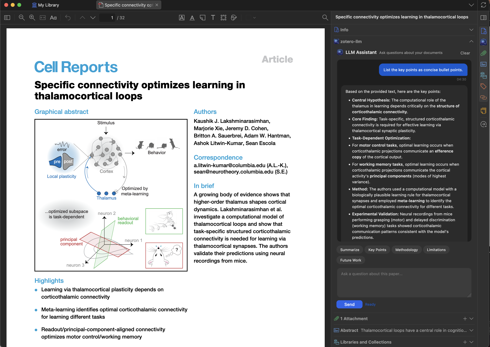

# Zotero-LLM: Your Right-Hand Side AI Research Assistant

**Zotero-LLM** is a powerful plugin for [Zotero](https://www.zotero.org/) that integrates Large Language Models (LLMs) directly into the Zotero PDF reader. Unlike other tools that require you to upload your pdfs to a portal, this plugin is designed to conveniently access LLMs without the need to leave Zotero. It quietly sits in the panel of the Zotero reader, like your standby research assistant, ready to help you with any questions you have when reading a paper.

Key Features
- 🎨 Simple and elegant interface: Keep your attention on the paper rather than the tool.

- 🔑 Bring Your Own Key (BYOK): Connect directly to your preferred LLM provider. You pay only for what you use, with no middleman subscription fees.

- 💬 Context-Aware Chat: Have a natural conversation with your PDF. The model has context of the paper currently open in your reader.

- ⚡ Quick-Action Presets: Use built-in prompts to instantly generate:

  - Summaries

  - Key Points (bulleted lists)

  - Methodology breakdowns

  - Limitations & Future Work analysis

  - All shortcuts are customizable.

- 📝 Seamless Integration: Lives inside the Zotero sidebar—no tab switching required.

### Installation

#### Step 1: Download the latest `.xpi` release
Download the latest `.xpi` release from the [Releases Page](https://github.com/yilewang/zotero-llm/releases).

Open `Zotero` and go to `Tools -> Add-ons`.

#### Step 2: Install the `.xpi` file
Click the gear icon and select `Install Add-on From File`

#### Step 3: Restart `Zotero`
Select the `.xpi` file and restart `Zotero` to complete the installation.

### Configuration

Open `Preferences` and navigate to the `Zotero-LLM` tab.

Select your Provider (e.g., OpenAI, Gemini, Local/Ollama).

Paste your API Key.

(Optional) Select your preferred model (e.g., gpt-4o, claude-3.5-sonnet).

Usage Guide
Chatting with a Paper

Open any PDF in the Zotero reader.

Open the LLM Assistant sidebar (click the distinct icon in the right-hand toolbar).

Type a question in the chat box, such as "What is the specific role of the thalamus mentioned in this paper?"

Using Preset Commands

Don't want to type? Use the quick buttons above the chat input to get immediate insights:

Summarize: Get a high-level abstract of the paper.

Key Points: Extract the core arguments and findings.

Methodology: Quickly understand how the experiments were conducted.

Example Workflow
Screenshot placeholder: [Insert your screenshot here]

In this example, the user asks for key points from "Specific connectivity optimizes learning in thalamocortical loops" and receives a structured breakdown of the Central Hypothesis and Core Findings.

FAQ
Q: Does this work with local models? A: Yes! You can point the plugin to a local endpoint (like Ollama) to run models entirely offline for maximum privacy.

Q: Is my data used to train models? A: No. Since you use your own API key, your data privacy is governed by the terms of the API provider you choose (e.g., OpenAI Enterprise terms usually exclude training on API data).